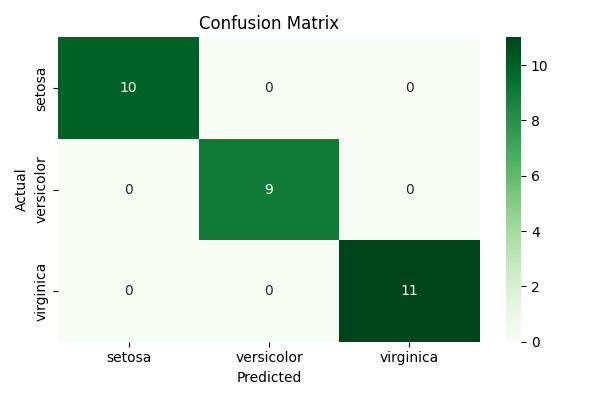
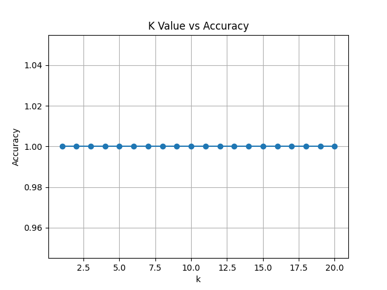
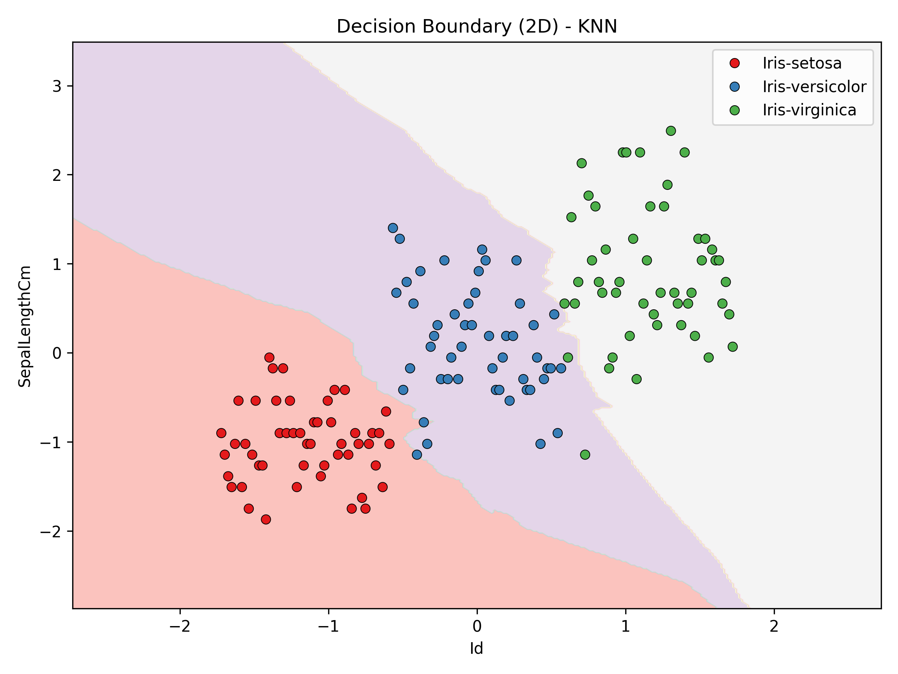
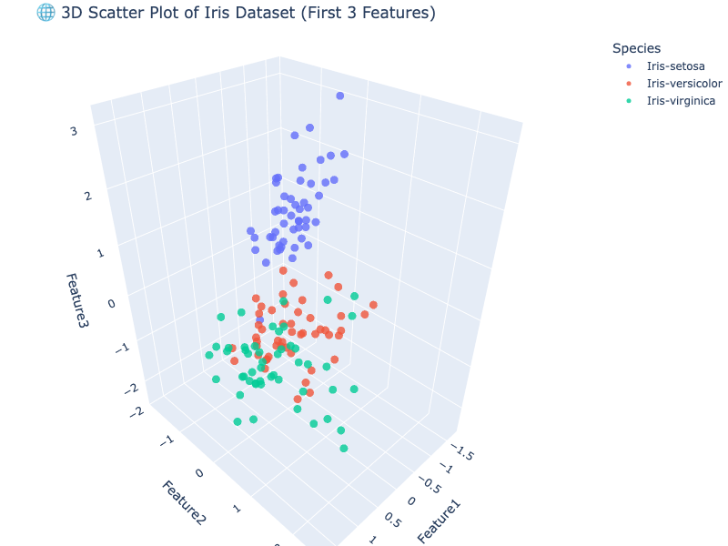

# 📘 Task 6: K-Nearest Neighbors (KNN) Classifier - Iris Dataset

## 🧠 Overview

In this project, I implemented and visualized a **K-Nearest Neighbors (KNN)** classifier using the popular **Iris Species** dataset. The notebook demonstrates how KNN can be used for multi-class classification, how to choose the best value for `k`, and how to visualize decision boundaries in both 2D and 3D.

---

## 📂 Dataset

* **Name:** Iris Species
* **Source:** [Kaggle](https://www.kaggle.com/uciml/iris)
* **Features:** Sepal length, sepal width, petal length, petal width
* **Target:** Species (Setosa, Versicolor, Virginica)

---

## 📊 What I Did

### ✅ Step-by-Step Breakdown:

1. **Data Preprocessing**

   * Loaded `Iris Species.csv`
   * Encoded species names using `LabelEncoder`
   * Scaled numeric features with `StandardScaler`

2. **Modeling with KNN**

   * Trained KNN classifier using `sklearn`
   * Tuned `k` values from 1 to 20
   * Plotted Accuracy vs K graph

3. **Evaluation**

   * Used `accuracy_score`, `confusion_matrix`, and `classification_report`

4. **Visualization**

   * 2D Decision Boundary using first 2 features
   * 3D Scatter Plot using first 3 features

---

## 📌 Key Visualizations

### 🔵 Confusion Matrix



### 📈 K Value vs Accuracy

This graph shows how different values of `k` affect model accuracy. It helped determine the best `k` to avoid overfitting or underfitting.



### 🟣 Decision Boundary (2D)



### 🌐 3D Scatter Plot (First 3 Features)



---

## 📈 Best Parameters

* **Best K value:** *Selected based on highest test accuracy*
* **Accuracy:** \~97-100% depending on split

---

## 💬 Interview Ready Questions

* How does KNN work?
* Why normalize features in KNN?
* How is K chosen?
* Time and space complexity of KNN?
* How does KNN handle multiclass classification?

---

## 📤 How to Run

```bash
pip install pandas numpy scikit-learn matplotlib seaborn plotly
jupyter notebook Task_6_KNN_Classifier.ipynb
```

---

## 🔗 Connect With Me

> 📬 [LinkedIn](https://www.linkedin.com/in/manish-kumar-srivastav)
> 🧠 Let me know your thoughts on this project or if you'd improve the visualizations!
